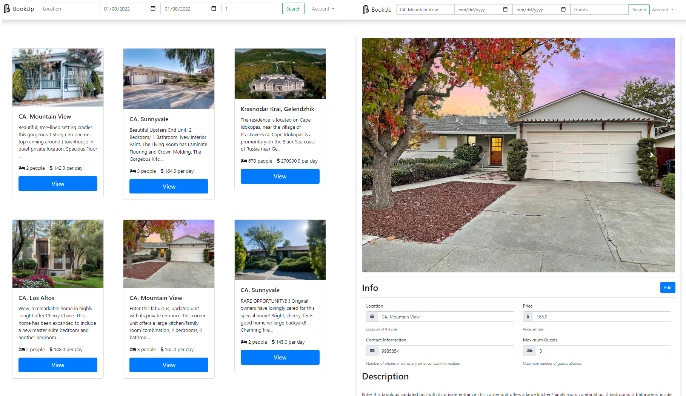

# BookUp
BookUp is a reservation platform for people who want go on vacations and can't find places to stay. Allows to rent and list houses. 
A perfectly reusable MVC software architecture allows to easily modify and change listings models.

* Ability for client/customer to register and login/logout.
* Be able to delete account/listings.
* Ability to search for listings by location/available dates/number of guests.
* Ability to book the listing.
  
## Getting Started
* Required dependencies include: Spring Boot, SQLite, Thymeleaf.
* Compile application using JDK 11+ and run.

## [Documentation](https://artak10t.github.io/BookUp/)
