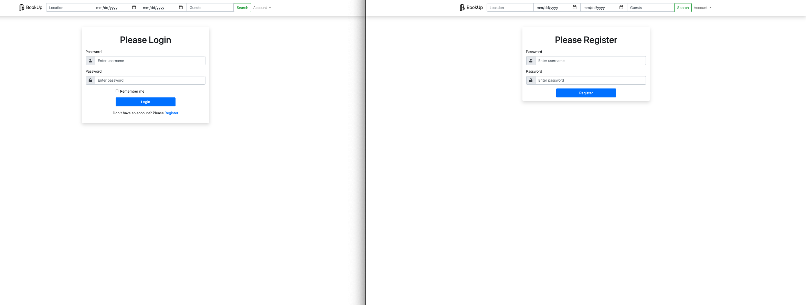
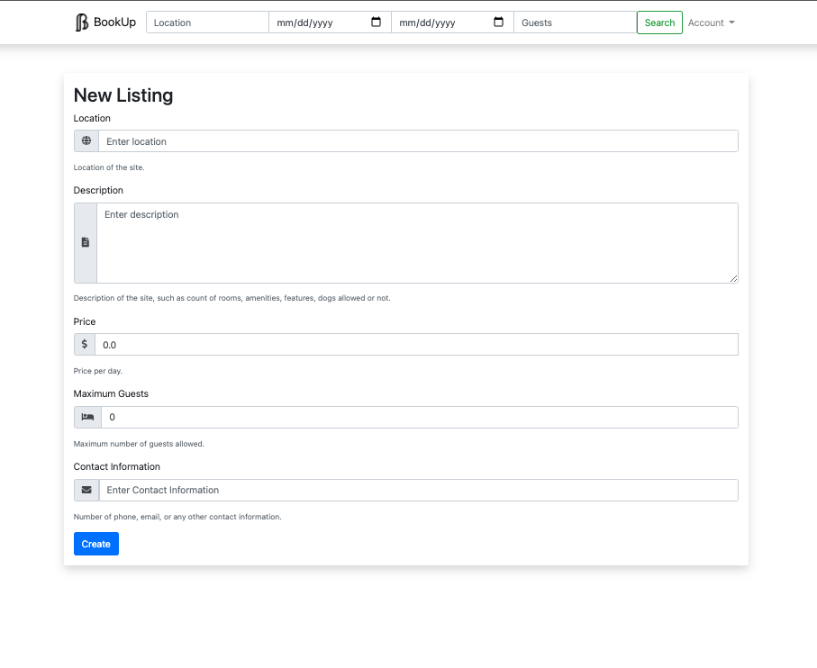
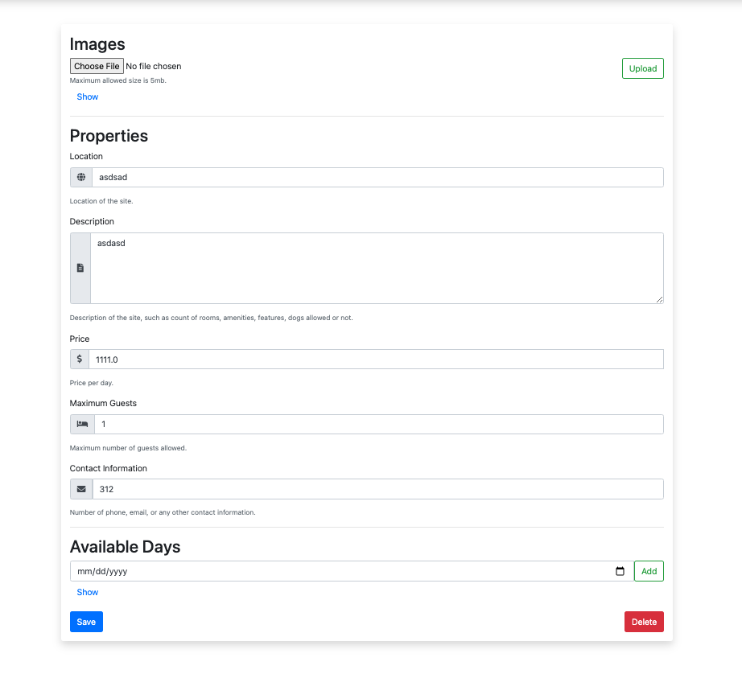
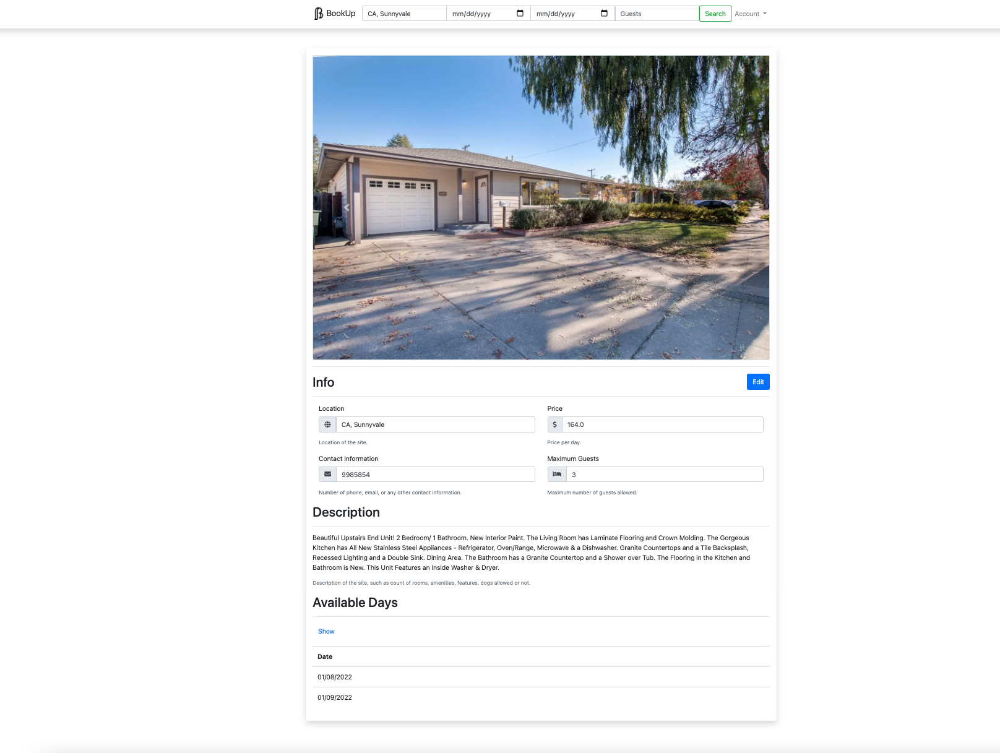

# BookUp

BookUp is a platform for people who want to go on vacations and find it difficult to secure a place to stay. 
It allows users to rent and list houses for their vacations. 
With a reusable MVC software architecture, it is easy to modify and change the listings models.

## Features

### User Registration and Login

### Ability to create and delete account/listings

### Search for listings by location, available dates, and number of guests

### Book a listing

## Running the Project

The following dependencies are required to run the project:
* Spring Boot
* SQLite
* Thymeleaf

Compile the application using JDK 11+ and run.

